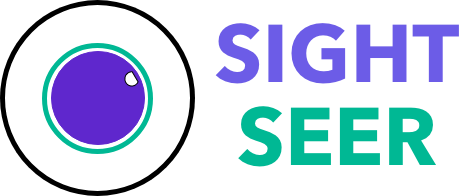

<p align="center">
    <br>
	
    <br>
<p>

<p align="center">
    <a href="https://github.com/rish-16/sight/blob/master/LICENSE">
		
    </a>
</p>

<h3 align="center">
<p>State-of-the-art Computer Vision and Object Detection for TensorFlow.</p>
</h3>

*sightseer* provides state-of-the-art general-purpose architectures (YOLOv3, MaskRCNN, Fast/Faster RCNN, SSD...) for Computer Vision and Object Detection tasks with 30+ pretrained models written in TensorFlow 1.15.

## Installation

`sightseer` is written in Python 3.5+ and TensorFlow 1.15. 

Ideally, `sightseer` should be installed in a [virtual environments](https://docs.python.org/3/library/venv.html). If you're unfamiliar with Python virtual environments, check out this [tutorial](https://packaging.python.org/guides/installing-using-pip-and-virtual-environments/) on getting started.

### Via PyPi

To use `sightseer`, you must first have TensorFlow installed. To do so, follow the instructions on the [TensorFlow installation page](https://www.tensorflow.org/install/pip?lang=python3).

When your virtual environment is set up with TensorFlow, you can install `sightseer` using `pip`:

```bash
pip install sightseer
```

### Model Architectures

1. YOLOv3 (Darknet by Joseph Redmon)
2. More upcoming!

## Features

<strong>1. Loading images</strong>

```python
from sightseer import Sightseer

ss = Sightseer()
image = ss.load_image("path/to/image")
```

<strong>2. Using models from `sightseer.zoo`</strong>

Once installed, any model offered by `sightseer` can be accessed in less than 10 lines of code. For instance, the code to use the YOLOv3 (Darknet) model is as follows:

```python
from sightseer import Sightseer
from sightseer.zoo import YOLOv3Client
from pprint import pprint

yolo = YOLOv3Client()
yolo.load_model() # downloads weights

# loading image from local system
ss = Sightseer()
image = ss.load_image("./images/road.jpg")

# getting labels, confidence scores, and bounding box data
preds, pred_img = yolo.predict(image, return_img=True)
pprint (preds)
ss.render_image(pred_img)
```

## Contributing

Suggestions, improvements, and enhancements are always welcome! If you have any issues, please do raise one in the Issues section. If you have an improvement, do file an issue to discuss the suggestion before creating a PR.

All ideas – no matter how outrageous – welcome!

## Licence

[Apache Licencse 2.0](https://github.com/rish-16/sight/blob/master/LICENSE)